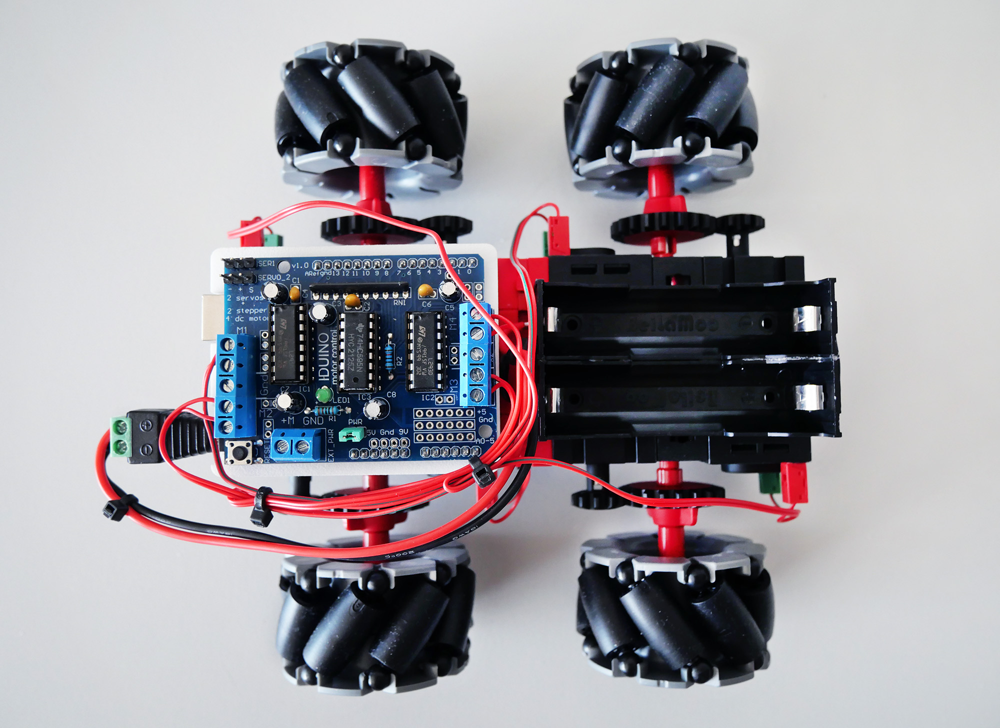

# fischertechnik Maker-Kits
This repository contains some small examples for different boards.

## Links
- [fischertechnik Maker](https://www.fischertechnik.de/de-de/maker)
- [Maker Kit Bionic](https://www.fischertechnik.de/de-de/produkte/maker/571902-maker-kit-bionic)
- [Maker Kit Omniwheels](https://www.fischertechnik.de/de-de/produkte/maker/571901-maker-kit-omniwheels)
- [Maker Kit Car](https://www.fischertechnik.de/de-de/produkte/maker/571900-maker-kit-car)

## Maker Kit Bionic

#### Arduino Uno + PCA9685 16-Channel Servo Driver:
[ftOpenCat](https://github.com/AlexanderSteiger/ftOpenCat) using [Arduino Uno Rev3](https://store.arduino.cc/collections/boards-modules/products/arduino-uno-rev3-smd) and [Adafruit PCA9685 16-Channel Servo Driver](https://learn.adafruit.com/16-channel-pwm-servo-driver?view=all)

## Maker Kit Omniwheels

#### Arduino Uno:
Example [ft_maker_omniwheels_arduino_uno.ino](/ft_maker_omniwheels_arduino_uno/ft_maker_omniwheels_arduino_uno.ino) using [Arduino Uno Rev3](https://store.arduino.cc/collections/boards-modules/products/arduino-uno-rev3-smd) and [Adafruit-Motor-Shield-library](https://github.com/adafruit/Adafruit-Motor-Shield-library)

#### fischertechnik TXT 4.0 Controller
Examples for [TXT 4.0 controller](https://www.fischertechnik.de/txt40controller) can be imported in [ROBO Pro Coding](https://www.fischertechnik.de/en/toys/apps-and-software) App
  
## Maker Kit Car

#### fischertechnik Receiver BT Control Set
fischertechnik [Receiver BT Control Set](https://www.fischertechnik.de/en/products/spare-parts/electronics/161943-receiver-bt-control-set) and [Bluetooth Control](https://www.fischertechnik.de/en/toys/apps-and-software) App
  

#### fischertechnik TXT 4.0 Controller
Examples for [TXT 4.0 controller](https://www.fischertechnik.de/txt40controller) can be imported in [ROBO Pro Coding](https://www.fischertechnik.de/en/toys/apps-and-software) App
